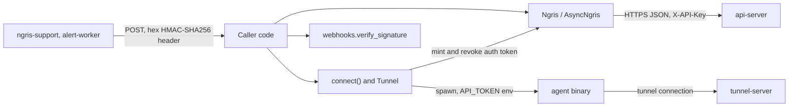
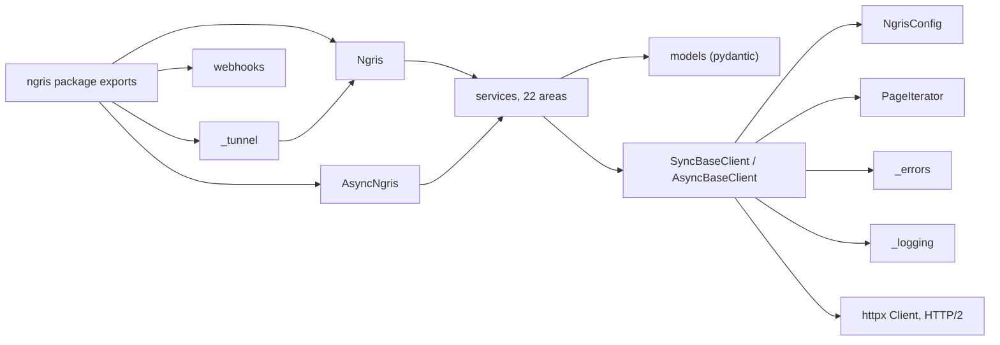
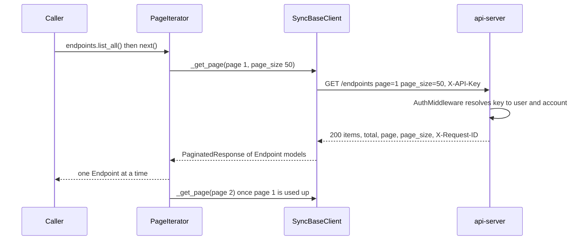
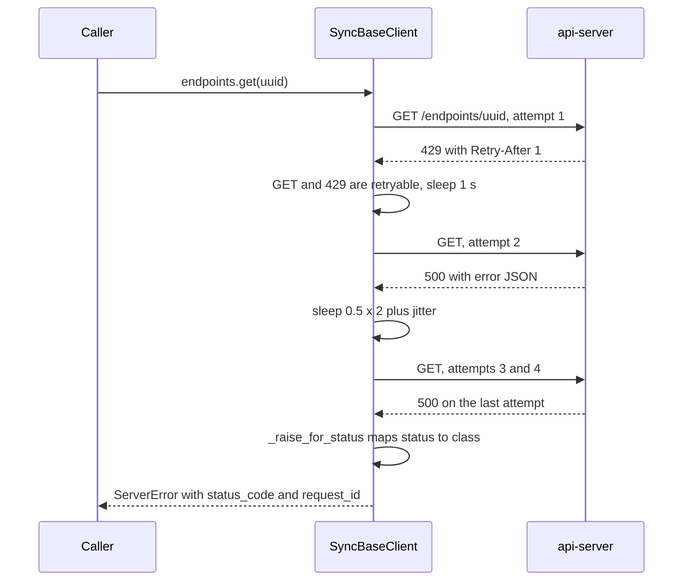

# ngris sdk architecture

The ngris sdk repository holds the client libraries for the ngris management API. Today it contains one library: the Python package `ngris` in `python/` (`python/pyproject.toml:6`). The package gives Python code a sync client (`Ngris`) and an async client (`AsyncNgris`) for the api-server REST API. It also has a `connect()` helper that runs the ngris agent as a child process to open a tunnel, and an HMAC check for incoming webhooks (`python/src/ngris/__init__.py:3-19`). It runs inside the caller's process, and nothing in ngris deploys it.

## At a glance

| | |
|---|---|
| Role | Client library for api-server, plus a tunnel launcher and a webhook signature check |
| Languages | Python only. `python/` is the only top-level folder. There is no Go, TypeScript or other SDK |
| Runtime | Python 3.10+ (`python/pyproject.toml:11`), on `httpx[http2]` and `pydantic` v2 (`python/pyproject.toml:30-31`) |
| Entrypoint | `import ngris`, which exports `Ngris`, `AsyncNgris`, `connect`, `disconnect`, `Tunnel`, `verify_signature`, `parse_event` and the error classes (`python/src/ngris/__init__.py:21-45`) |
| Ports | None. Outbound HTTPS to the base URL, with HTTP/2 on by default (`python/src/ngris/_config.py:56`) |
| How it runs | Imported in-process. `connect()` adds one child process, the agent binary (`python/src/ngris/_tunnel.py:427-435`) |
| State | Nothing on disk. Each client holds one httpx connection pool and a cache of service objects (`python/src/ngris/_base_client.py:212-217`, `python/src/ngris/_sync_client.py:51`) |
| Main dependencies | api-server, and the agent binary for `connect()` |
| Packaging | hatchling wheel `ngris` 0.1.0 (`python/pyproject.toml:1-7`). The repository has no CI or publish workflow |

## Context

- **api-server.** Each service method sends a path relative to the base URL, with the key in `X-API-Key` (`python/src/ngris/_base_client.py:112-128`). api-server's `AuthMiddleware` checks `X-API-Key` before any cookie or Bearer token and authenticates it as an account API key (`shared/auth/middleware.go:420-447`). A bad key gets a plain-text 401 (`shared/auth/middleware.go:452`). CSRF checks are skipped only when the key's hash is in `api_keys` (`api-server/api/csrf.go:279-284`). api-server mounts every route under `/api` and mirrors them under `/api/v1`. It also rewrites `/v1/...` to `/api/v1/...` (`api-server/main.go:718`, `api-server/routes/routes.go:49-50`, `api-server/main.go:801-804`). It is served at `api.ngris.com` (`deploy/helm/api-server/values.yaml:68`). The SDK's default base URL is `https://api.ngris.io` with no path prefix (`python/src/ngris/_config.py:73`). See [Mismatches with the real API](#mismatches-with-the-real-api).
- **agent binary.** `connect()` mints an agent auth token with `POST /keys/auth`. It then starts `<agent> http|tcp <addr> --no-tui` with the token in `API_TOKEN`, and revokes the token on close (`python/src/ngris/_tunnel.py:387-410`, `python/src/ngris/_tunnel.py:170-175`). The agent reads `API_TOKEN` as its auth token (`agent/config/config.go:234`) and finds a tunnel-server on its own through discovery (`agent/tunnel/endpoints.go:33-36`).
- **Webhook senders.** `verify_signature` computes the hex HMAC-SHA256 of the raw body with the shared secret and compares the two values in constant time (`python/src/ngris/webhooks.py:75-111`). That matches two senders:
  - ngris-support signs a body of `event`, `data` and `timestamp`, and sends `X-Webhook-Signature` and `X-Webhook-Event` (`ngris-support/handlers/support_webhooks.go:39-54`).
  - alert-worker sends the same kind of digest in `X-Ngris-Signature` (`alert-worker/evaluator/notify.go:162-166`).

  ngris-board puts `sha256=` in front of its value (`ngris-board/internal/api/webhooks.go:166`). `verify_signature` does not strip that prefix, so it rejects those signatures.

## Inside

| Module | Responsibility | Key files |
|---|---|---|
| `_config` | Settings dataclass, with fallbacks to `NGRIS_API_KEY` and `NGRIS_BASE_URL` | `python/src/ngris/_config.py:19-73` |
| `_base_client` | Headers, URL join, request loop with retries, response parsing, page fetches. The sync and async halves are copies of each other | `python/src/ngris/_base_client.py:105-399`, `python/src/ngris/_base_client.py:402-588` |
| `_sync_client`, `_async_client` | Constructors that require an API key. 22 lazy properties, one per API area | `python/src/ngris/_sync_client.py:24-51`, `python/src/ngris/_async_client.py:24-48` |
| `services/` | One sync and one async class per area. Each method builds the path and JSON body and picks a helper | `python/src/ngris/services/endpoints.py:10-51` |
| `models/` | Pydantic models. Unknown fields are ignored and missing required fields fail | `python/src/ngris/models/_common.py:8-11` |
| `_errors` | Exception classes, mapping from status code to class, `Retry-After` parsing | `python/src/ngris/_errors.py:88-158` |
| `_pagination` | Page model and iterators, with a `max_pages` cap | `python/src/ngris/_pagination.py:17-80` |
| `_logging` | Logger `ngris.http`, header and body redaction, request-id lookup | `python/src/ngris/_logging.py:35-138` |
| `_tunnel` | Wrapper that runs the agent as a child process | `python/src/ngris/_tunnel.py:322-478` |
| `webhooks` | Signature check and a replay window | `python/src/ngris/webhooks.py:80-153` |

Services return responses through four helper families (`python/src/ngris/_base_client.py:306-368`):

- `_*_json` validates the body into a model.
- `_*_raw` returns a dict and wraps a top-level list as `{"items": [...]}` (`python/src/ngris/_base_client.py:66-87`).
- `_*_void` discards the body.
- Some list methods call `_get` and return `resp.json()` unchanged.

`_delete_void` treats a 404 as success (`python/src/ngris/_base_client.py:364-368`). A pydantic validation failure surfaces as `pydantic.ValidationError`, not as an `NgrisError`.

**API areas.** The table below comes from matching every SDK method and path against the `HandleFunc` registrations in `api-server/routes/*.go`.

| Client attribute | Paths | Against api-server |
|---|---|---|
| `auth` | `/auth/login`, `/auth/mfa`, `/auth/forgot-password`, `/auth/reset-password`, `/auth/token`, `/auth/verify-email`, `/auth/resend-verification` | Routes exist (`api-server/routes/auth.go:38-86`) |
| `users` | `/user`, `/user/{id}`, `/account/plan`, `/account/entitlements`, `/account/usage` | `PUT /user/{id}` has no route. The others exist (`api-server/routes/user.go:38-39`, `api-server/routes/account.go:69-95`) |
| `billing` | `/billing/*` (checkout, subscription, cancel, reactivate, pause, resume, portal, payment methods, invoices, balance), `/coupons/validate` | Routes exist (`api-server/routes/billing.go:33-68`, `api-server/routes/user.go:355`) |
| `endpoints` | `/endpoints` (paged), `/endpoints/{uuid}`, and its `/certificate`, `/settings`, `/health` and `/promote` | Routes exist (`api-server/routes/user.go:119-144`) |
| `endpoint_oauth`, `endpoint_rbac`, `traffic_policies`, `routing_rules` | `/endpoints/{uuid}/oauth/providers*`, `/oauth/presets`, `.../rbac*`, `.../policies*`, `.../routing-rules*` | Routes exist (`api-server/routes/user.go:237-299`) |
| `firewall` | `/firewall/policies*`, `/firewall/rate-limits*` | Routes exist (`api-server/routes/user.go:359-377`) |
| `domains`, `certificates`, `api_keys` | `/domains/available`, `/domains/self*`, `/certificates/self*`, `/keys/api*`, `/keys/auth*` | Routes exist (`api-server/routes/user.go:302-346`) |
| `client_cas`, `dedicated_ips`, `sso`, `regions` | `/client-cas*`, `/endpoints/{uuid}/mtls`, `/dedicated-ips*`, `/sso/config*`, `/plans`, `/regions`, `/addons` | Routes exist (`api-server/routes/user.go:115-116`, `api-server/routes/user.go:438-471`) |
| `tunnels`, `traffic` | `/tunnels`, `/tunnels/{id}`, `/traffic/logs*` (paged), `/traffic/metrics`, `/traffic/smart-search` | Routes exist (`api-server/routes/user.go:104-105`, `api-server/routes/user.go:383-410`) |
| `templates` | `/templates*` | Routes exist, but upload needs a multipart form (`api-server/routes/user.go:399-407`) |
| `organizations` | `/organizations`, `/organization/*` | No such route in api-server |
| `support` | `/support/tickets*` | Not on api-server any more (`api-server/routes/routes.go:90-91`) |
| `ai_chat` | `/ai/sessions*` | Not on api-server. ai-gateway serves `/v1/ai/sessions` (`ai-gateway/handlers/routes.go:42`, `ai-gateway/handlers/routes.go:66-70`) |

**Tunnel launcher.** `connect(addr)` works as follows:

1. It requires an API key and accepts only `http` and `tcp` (`python/src/ngris/_tunnel.py:362-378`).
2. It finds the agent binary: the `agent_bin` argument first, then `NGRIS_AGENT_BIN`, then `ngris-agent` or `easytunnel-agent` on `PATH` (`python/src/ngris/_tunnel.py:41-44`, `python/src/ngris/_tunnel.py:74-105`).
3. It mints a token whose description is `ngris-python sdk (<proto> <addr>)` (`python/src/ngris/_tunnel.py:391-396`).
4. It starts the agent in its own session (`python/src/ngris/_tunnel.py:401-435`).
5. It reads stdout until a line matches `Public URL:\s*(https?://\S+)`, with a 30 s default timeout (`python/src/ngris/_tunnel.py:52-57`, `python/src/ngris/_tunnel.py:245-319`). If the wait fails, it kills the process and revokes the token (`python/src/ngris/_tunnel.py:441-470`).

`Tunnel.close()` sends SIGTERM, then SIGKILL after 5 s, then revokes the token and closes the client. An `atexit` hook only stops the process (`python/src/ngris/_tunnel.py:145-196`).

## Key flows

### Authenticated, paginated list

- Every request carries `X-API-Key`, `Accept: application/json` and `User-Agent: ngris-python/<version> (httpx/...; python/...; <os>)`. `Content-Type` is added only when there is a body. `extra_headers` cannot override the auth or user-agent headers (`python/src/ngris/_base_client.py:39-44`, `python/src/ngris/_base_client.py:112-128`, `python/src/ngris/_config.py:16`).
- The client sends `page` and `page_size` (`python/src/ngris/_base_client.py:370-384`). api-server reads the same names, caps `page_size` at 200 by default, and returns `items`, `total`, `page` and `page_size` (`api-server/api/handlers.go:1614-1623`, `api-server/api/handlers.go:167-171`, `api-server/api/handlers.go:2111-2116`).
- The iterator stops on an empty page, when `page * page_size >= total`, or after `max_pages` (default 1000) (`python/src/ngris/_pagination.py:62-80`). The stop check uses the client's page size, not the size the server returns. So a `page_size` above the server's cap ends iteration early.
- Only `endpoints.list`/`list_all` and `traffic.list_logs` are paged, and only endpoints has `list_all` (`python/src/ngris/services/endpoints.py:13-17`, `python/src/ngris/services/traffic.py:13-14`). Traffic logs use the same envelope (`api-server/api/traffic_handlers.go:583-588`).
- With an API key, the request runs in the key's account (`shared/auth/middleware.go:426-435`).

### Error and retry

- A response is retried only when its status is in `retry_on_status` (429, 500, 502, 503, 504) and its method is in `retry_on_methods` (GET, HEAD, PUT, DELETE, OPTIONS). POST is never retried by default (`python/src/ngris/_config.py:12`, `python/src/ngris/_config.py:41-45`, `python/src/ngris/_base_client.py:133-139`).
- The wait is the `Retry-After` value (seconds or an HTTP date) when present. Otherwise it is `min(0.5 * 2^attempt, 10)` plus up to 10% jitter (`python/src/ngris/_base_client.py:141-151`, `python/src/ngris/_errors.py:88-112`). `Retry-After` is not capped by `backoff_max`. api-server's per-IP limit sends `Retry-After: 1` (`api-server/api/middleware.go:255-256`). Its maintenance gate sends 300 s by default and up to 24 h (`api-server/api/maintenance.go:41-43`), so a GET during maintenance blocks for 15 minutes before it fails.
- `httpx.ConnectError` is retried for every method because the request never reached the server. Other httpx errors, such as timeouts, raise `NgrisConnectionError` at once (`python/src/ngris/_base_client.py:279-302`).
- The error message comes from `{"error": ...}`, which is api-server's error shape (`api-server/api/handlers.go:196-199`), or else from the raw body. The status maps to a class: 401 `AuthenticationError`, 403 `PermissionDeniedError`, 404 `NotFoundError`, 400/422 `ValidationError`, 429 `RateLimitError` with `retry_after`, 5xx `ServerError`, anything else `NgrisError` (`python/src/ngris/_errors.py:115-158`).
- `request_id` comes from `X-Request-ID` or `X-Correlation-ID` (`python/src/ngris/_logging.py:125-138`). api-server sets `X-Request-ID` on its responses (`shared/auth/middleware.go:346`, `shared/auth/middleware.go:405`). A non-JSON body where JSON was expected raises `MalformedResponseError` (`python/src/ngris/_base_client.py:153-171`).

## Data and state

The SDK keeps no tables, keys or files of its own.

| What | Where | Lifetime |
|---|---|---|
| httpx connection pool (100 connections, 20 keep-alive) | `python/src/ngris/_base_client.py:212-217`, `python/src/ngris/_config.py:63-64` | Until `close()` or the end of the context manager |
| Service objects | `_services` dict on the client (`python/src/ngris/_sync_client.py:51-57`) | Life of the client |
| Agent auth token (row in api-server's auth tokens) | Created by `POST /keys/auth`, deleted by `DELETE /keys/auth/{id}` (`api-server/routes/user.go:345-346`) | From `connect()` until `Tunnel.close()`. Left behind if the process exits through `atexit` (`python/src/ngris/_tunnel.py:184-196`) |
| Agent child process | `Tunnel._proc` (`python/src/ngris/_tunnel.py:108-136`) | Until `close()` or interpreter exit |

## Configuration

Pass these as keyword arguments to `Ngris(...)` or `AsyncNgris(...)`. Unknown keyword arguments are dropped without an error (`python/src/ngris/_sync_client.py:37-44`).

| Setting | Default | Effect |
|---|---|---|
| `api_key` / `NGRIS_API_KEY` | none, required | Sent as `X-API-Key`. The constructor raises `ValueError` if it is empty (`python/src/ngris/_config.py:70-71`, `python/src/ngris/_sync_client.py:45-48`) |
| `base_url` / `NGRIS_BASE_URL` | `https://api.ngris.io` | Prefix for every path, with any trailing `/` removed (`python/src/ngris/_config.py:72-73`, `python/src/ngris/_base_client.py:110`) |
| `connect_timeout`, `read_timeout`, `write_timeout`, `pool_timeout` | 5, 30, 30, 5 s | Per-phase httpx timeouts (`python/src/ngris/_config.py:37-40`, `python/src/ngris/_base_client.py:47-56`) |
| `timeout` | 30 | Stored but never read. The comment says it overrides the per-phase values, but `_httpx_timeout` ignores it (`python/src/ngris/_config.py:33-36`) |
| `max_retries`, `retry_on_status`, `retry_on_methods`, `backoff_factor`, `backoff_max` | 3, (429, 500, 502, 503, 504), safe verbs, 0.5, 10 | Retry policy (`python/src/ngris/_config.py:41-47`) |
| `default_page_size`, `max_pages` | 50, 1000 | Paging (`python/src/ngris/_config.py:48-51`) |
| `http2`, `verify` | True, True | HTTP/2 falls back to HTTP/1.1 with a warning when `h2` is missing. `verify` can be a CA bundle path (`python/src/ngris/_config.py:56-60`, `python/src/ngris/_base_client.py:202-211`) |
| `pool_max_connections`, `pool_max_keepalive`, `extra_headers` | 100, 20, {} | Pool size and extra request headers (`python/src/ngris/_config.py:63-65`) |
| `NGRIS_AGENT_BIN` | unset | Path to the agent binary for `connect()` (`python/src/ngris/_tunnel.py:44`) |

## Operating it

- **Logs.** The SDK logs through stdlib `logging` on `ngris.http` and never calls `basicConfig` (`python/src/ngris/_logging.py:35-36`). INFO logs one line per response with status, duration and request id. A retry is logged at WARNING and a final transport failure at ERROR. DEBUG logs request headers and body after redaction (`python/src/ngris/_base_client.py:232-276`). Redaction masks auth and cookie headers and body keys that look like secrets, and cuts bodies at 4096 bytes (`python/src/ngris/_logging.py:41-73`).
- **Failure modes.** Every error is raised; nothing fails open, except two cases. `_delete_void` swallows 404, so a delete on a path the server does not have (`organizations.delete`, `ai_chat.delete_session`) returns as if it worked (`python/src/ngris/_base_client.py:364-368`). Webhook age checks are skipped when `timestamp` is missing or cannot be parsed (`python/src/ngris/webhooks.py:142-150`).
- **Packaging and publishing.** The build backend is hatchling. The wheel contains `src/ngris`, including the `py.typed` marker (`python/pyproject.toml:1-3`, `python/pyproject.toml:52-53`). Dev extras are pytest, pytest-asyncio, respx, ruff and mypy (`python/pyproject.toml:43-50`). Ruff checks `E`, `F`, `I` and `W`, and mypy runs in strict mode (`python/pyproject.toml:59-68`). The repository has no CI workflow and no publish job, and none of the workflows in `~/easytunnel/.github/workflows` mention the SDK or PyPI. Release is therefore a manual build and upload. The package URLs point to `github.com/ngris-edge/ngris-python` (`python/pyproject.toml:36-41`).
- **Versioning.** The version `0.1.0` is written in two places that must be bumped together: `python/pyproject.toml:7` and `python/src/ngris/_version.py:1`. The second is sent in the User-Agent. The SDK pins no API version. api-server serves the same routes on `/api` and on `/api/v1` with an `API-Version: v1` header (`api-server/routes/routes.go:49-52`, `api-server/api/routes.go:12-17`).
- **Tests and examples.** There is no examples folder. Usage samples are in docstrings (`python/src/ngris/_sync_client.py:11-22`, `python/src/ngris/_tunnel.py:354-356`, `python/src/ngris/webhooks.py:12-28`). The `python/tests` suite has 108 test functions and runs against respx mocks of `https://api.ngris.io`, never a live server (`python/tests/conftest.py:14-34`). `tests/services/test_body_shapes.py` pins request bodies for handlers that reject unknown fields (`python/tests/services/test_body_shapes.py:1-19`).

### Mismatches with the real API

These were each confirmed in the code.

| SDK | Real behaviour | Effect |
|---|---|---|
| Default base `https://api.ngris.io`, paths without `/api` (`python/src/ngris/_config.py:73`) | api-server is at `api.ngris.com` under `/api`, `/api/v1` or `/v1` (`deploy/helm/api-server/values.yaml:68`, `api-server/main.go:718`). `*.ngris.io` is the tunnel-server wildcard host (`deploy/helm/tunnel-server/values.yaml:113`). The agent defaults to `https://api.ngris.com/api/` (`agent/tunnel/endpoints.go:36`) | No call works without an explicit `base_url` |
| `organizations` (`python/src/ngris/services/organizations.py:12-39`) | No `/organization*` route exists in `api-server/routes` | 404 on every call |
| `support` (`python/src/ngris/services/support.py:11-34`) | Support moved to ngris-support (`api-server/routes/routes.go:90-91`), at `support.ngris.com` (`deploy/helm/ngris-support/values.yaml:57`). The `api.ngris.com` listener has one backend (`tf-infra/ansible/inventory/prod/group_vars/public-gw/listeners.yaml:224-233`) | 404 |
| `ai_chat` (`python/src/ngris/services/ai_chat.py:11-29`) | ai-gateway, on its own host, under `/v1`, with JWT auth only (`ai-gateway/handlers/routes.go:42-55`, `ai-gateway/handlers/auth_middleware.go:147-148`) | 404 |
| `users.update` sends `PUT /user/{id}` (`python/src/ngris/services/users.py:16-17`) | Only `PUT /user` exists (`api-server/routes/user.go:39`) | 404 |
| `users.me()` validates a full `User` that needs `plan`, `max_*`, `balance_cents` and `updated_at` (`python/src/ngris/models/users.py:8-22`) | `GET /user` returns a smaller profile and leaves out `role` for normal users (`api-server/api/user_security_handlers.go:49-67`) | `pydantic.ValidationError` |
| `auth.login` parses `user` as `User` (`python/src/ngris/models/auth.py:20-23`) | The MFA-required reply has only `id`, `username`, `email` and `role` in `user` (`api-server/api/handlers.go:7182-7193`) | `pydantic.ValidationError` on MFA accounts |
| `auth.generate_token` expects `id` (`python/src/ngris/models/auth.py:26-29`) | It returns only `token` (`api-server/api/handlers.go:7775-7777`) | `pydantic.ValidationError` |
| `Endpoint.user_id: int` is required (`python/src/ngris/models/endpoints.py:11`) | `user_id` is nullable and left out when null (`shared/models/endpoint.go:42-46`) | Listing or getting agent-born or transferred endpoints fails |
| `billing.list_invoices` loops over the body as a list (`python/src/ngris/services/billing.py:53-56`) | Returns `{"invoices": [...], ...}` once invoices exist (`api-server/api/billing_handlers.go:5989-5994`) | `pydantic.ValidationError` |
| `list_api_keys`, `list_auth_tokens` and `tunnels.list` are typed as lists (`python/src/ngris/services/api_keys.py:11-23`, `python/src/ngris/services/tunnels.py:12-14`) | Return `{"items": ...}` (`api-server/api/handlers.go:7910`, `api-server/api/handlers.go:8135`, `api-server/api/handlers.go:10454-10456`) | Callers get a dict |
| `create_auth_token(endpoint_id: str)` (`python/src/ngris/services/api_keys.py:25-29`) | `endpoint_id` is `*int64`, and the decode error is ignored (`api-server/api/handlers.go:8207-8214`) | The token is minted without the endpoint binding, silently |
| `templates.upload` posts JSON (`python/src/ngris/services/templates.py:16-17`) | Needs a multipart field `template` (`api-server/api/templates_handlers.go:108-119`) | Upload fails |
| `connect()` looks for `ngris-agent` or `easytunnel-agent` (`python/src/ngris/_tunnel.py:41`) | The released binary is `ngris` (`agent/.goreleaser.yaml:13`) | `FileNotFoundError` unless `NGRIS_AGENT_BIN` is set |
| `connect(server=...)` passes `--server` (`python/src/ngris/_tunnel.py:404-405`) | The http and tcp flag sets have no `--server` and exit on unknown flags (`agent/main.go:757`, `agent/main.go:857`) | The agent exits and the SDK raises `TunnelStartupError` |
| `connect()` waits for `Public URL:` on stdout (`python/src/ngris/_tunnel.py:52`) | Only `printStats` prints that line, and nothing calls it. When a local address is set, it prints a `->` line instead (`agent/tunnel/client.go:1797`, `agent/tunnel/client.go:1856-1860`) | `connect()` times out after 30 s |
| `connect()` rejects `udp` as "not an agent subcommand" (`python/src/ngris/_tunnel.py:374-378`) | The agent has a `udp` subcommand (`agent/main.go:371-373`) | UDP tunnels cannot be started from the SDK |

## Code map

| To change | Start at |
|---|---|
| Auth header, user agent, reserved headers | `python/src/ngris/_base_client.py:112-128` |
| Default base URL and environment fallbacks | `python/src/ngris/_config.py:67-73` |
| Retry policy and backoff | `python/src/ngris/_config.py:41-47`, `python/src/ngris/_base_client.py:133-151` |
| Request loop (sync / async) | `python/src/ngris/_base_client.py:228-304`, `python/src/ngris/_base_client.py:434-503` |
| Mapping from status to exception | `python/src/ngris/_errors.py:115-158` |
| Pagination | `python/src/ngris/_base_client.py:370-399`, `python/src/ngris/_pagination.py:35-80` |
| Add an API area | a new `python/src/ngris/services/*.py` pair, plus properties in `python/src/ngris/_sync_client.py:53-183` and `python/src/ngris/_async_client.py` |
| Response models | `python/src/ngris/models/_common.py:8-11` and the area's model file |
| Log redaction | `python/src/ngris/_logging.py:41-73` |
| Tunnel launch and agent arguments | `python/src/ngris/_tunnel.py:322-478` |
| Webhook verification | `python/src/ngris/webhooks.py:80-153` |
| Package metadata and version | `python/pyproject.toml:5-41`, `python/src/ngris/_version.py:1` |

_Generated from sdk source at commit 0176f20 on 2026-10-09. Every statement cites the code it comes from; if the code changes, this page should be re-checked._
